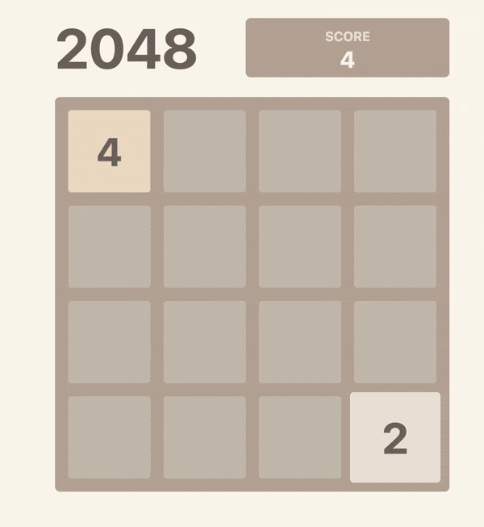

# 2048

## [Play 2048 💥]

## Features

- Fully-functional 2048 clone
- Animations
- Supports **keyboard**, **mouse** and **touch** events

## Development

_Easily set up a local development environment!_

Just start dev server on [localhost](http://localhost:3000):

- clone
- `npm install`
- `npm run dev`
